# Monitoring jankins operation using Promethus and Grafan

You will need 2 vm to follow this guide.

If using Oracle Cloud use oci-instance.sh to create 2 free arm VMs uing Ubuntu 24.04.3

### Setup Jenkins

```bash
# Step 1 - get system in upto date state

sudo apt update
sudo apt upgrade -y

sudo systemctl reboot
```

Always follow latest guide for installation from [Jenkins Docs](https://www.jenkins.io/doc/book/installing/linux/)

Note : As this vm is dedicated to Jenkins i won't be using conatianers

```bash
# Step 2 - Install java

sudo apt install fontconfig openjdk-21-jre
java -version
```


```bash
# Step 3 - Add jenkins repo and install jenkins (in this case LTS)

sudo wget -O /etc/apt/keyrings/jenkins-keyring.asc \
  https://pkg.jenkins.io/debian-stable/jenkins.io-2023.key
echo "deb [signed-by=/etc/apt/keyrings/jenkins-keyring.asc]" \
  https://pkg.jenkins.io/debian-stable binary/ | sudo tee \
  /etc/apt/sources.list.d/jenkins.list > /dev/null
sudo apt update
sudo apt install jenkins -y

# Check if Jenkins status is enabled and its port
sudo systemctl status jenkins
```

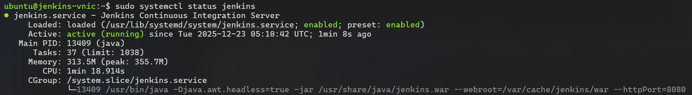

Make sure you have opened port 8080 for ingress at your cloud provider

```bash
# Check your osl level iptables

sudo iptables -L INPUT --line-numbers
```

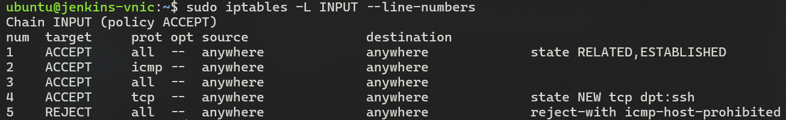

Note :- My my vm at OCI has defaults which block all connections except ssh

```bash
# Open port 8080 from iptables

sudo iptables -I INPUT 5 -p tcp --dport 8080 -j ACCEPT
# Inserts ingress rule for port 8080 at line 5 before blocking all connecction at line 6

```

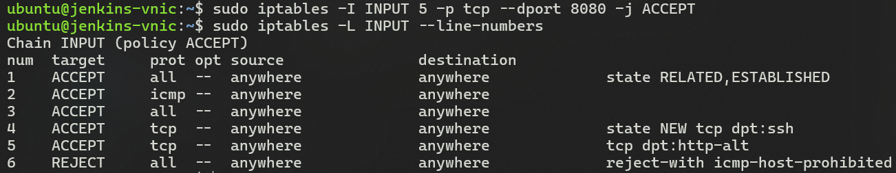

Now you can visit your-ip:8080, and you will be greeted with

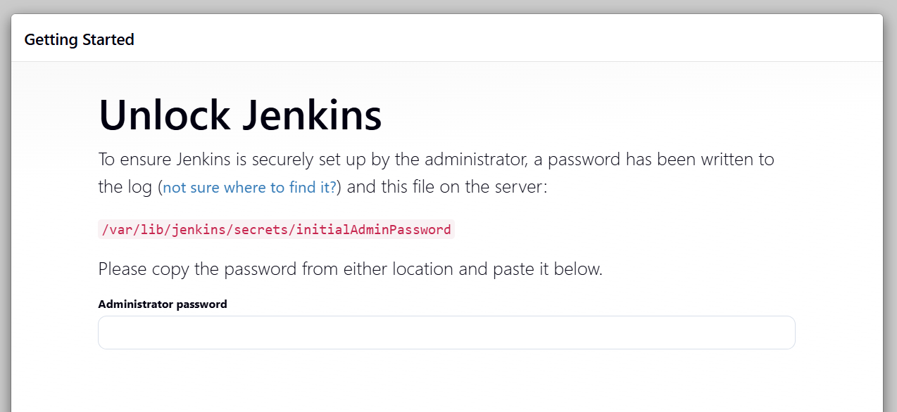

```bash
# Step 4 - get the default password

sudo cat /var/lib/jenkins/secrets/initialAdminPassword
```

Once you enter the password it will aks you for your plugins prefrence.

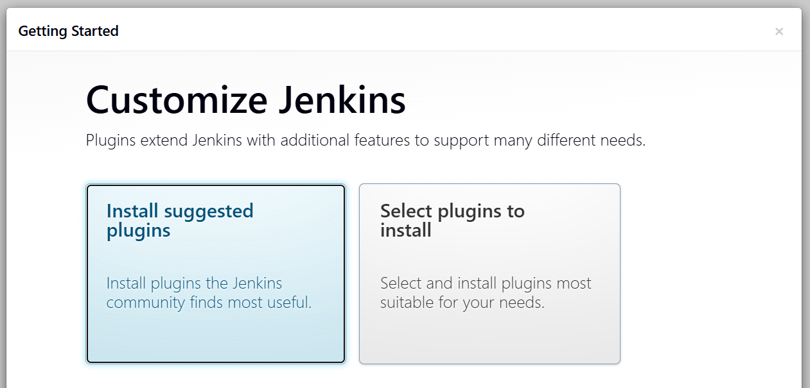

Install Suggested Pluis is a good start

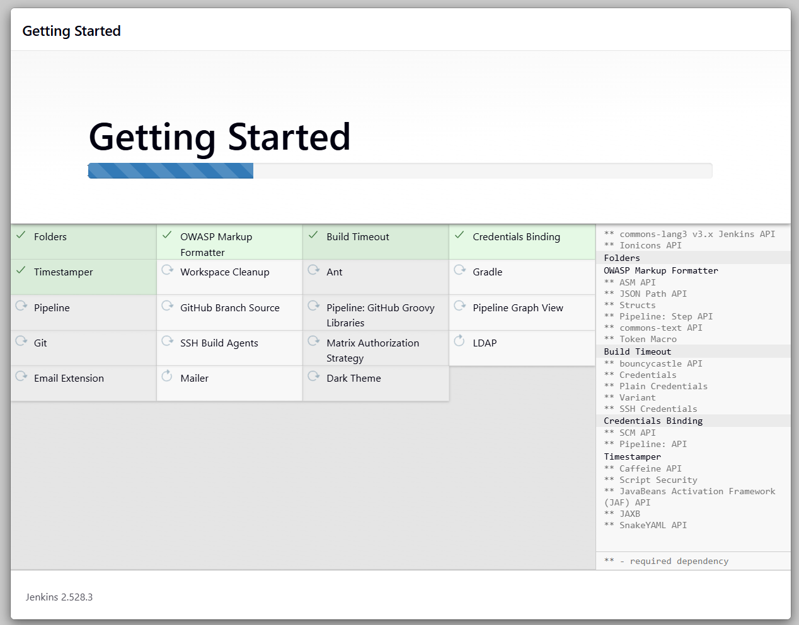

Once the init has finished it will ask you to setup an admin user

**Warning :-** Do not use username and passwords like admin, butler, jenkins etc. even if it is for testing

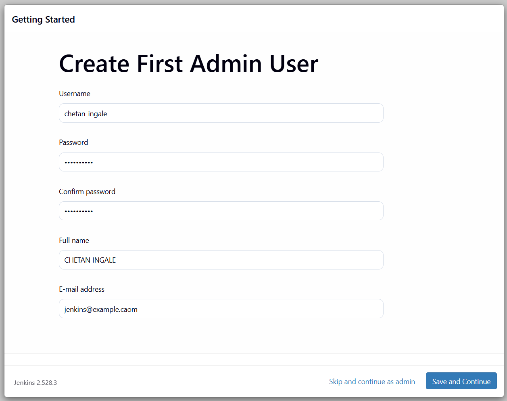

Create user, confirm the url and you are ready

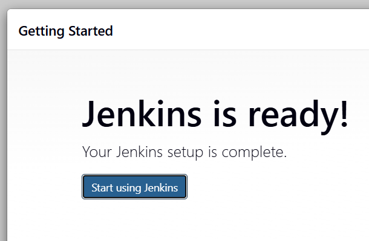

You will now be greated with an empth home page, but before doing any thing else navigate to **Settings gear > Appearence > Theme > Dark(System) > CheckBox: Tick all chekboxes**

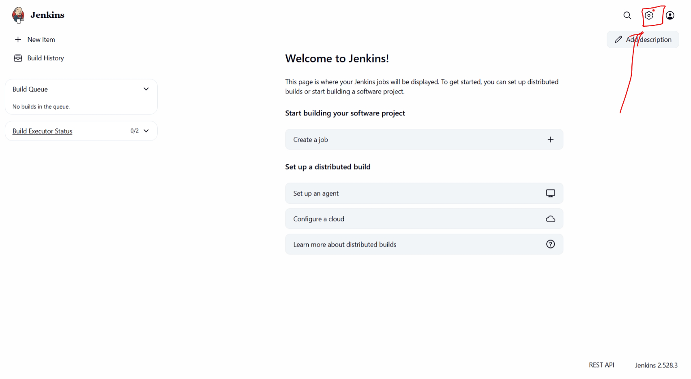
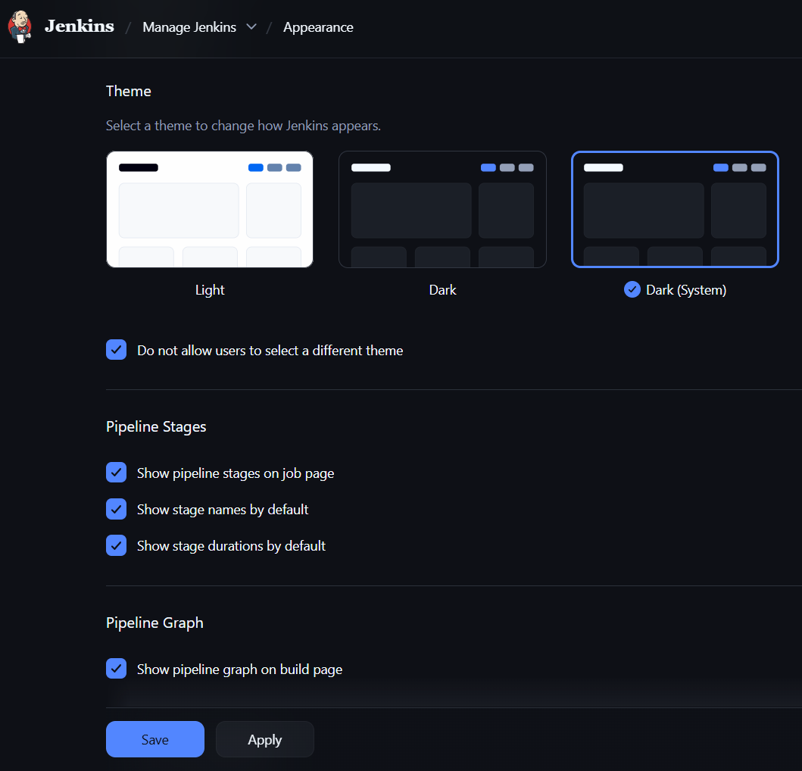

**Not doing this can lead to major security vulnerablility for you and your org users**

```bash
# Step 5 - Install plugins
```

Navigate to **Settings gear > System Configuration > Plugins > Availabe Plugins > Seacth prometheus > Install Prometheus metrics**

Jenkins will ask to restart, let it do its thing.

Now if you visit your-ip:8080/prometheus you can see metrics for your jenkins server

### Setup Podman

```bash
# Step 1 - get system in upto date state

sudo apt-get update
sudo apt-get upgrade -y

sudo systemctl reboot
```

Always follow latest guide for installation from [Podman Docs](https://podman.io/docs/installation)

```bash
# Step 2 - Install Poadman

sudo apt-get -y install podman
# As my OS is Ubuntu, I will be using debian pkg.
```

```bash
# Step 3 - Check if it is properly installed

podman version
podman ps -a
```

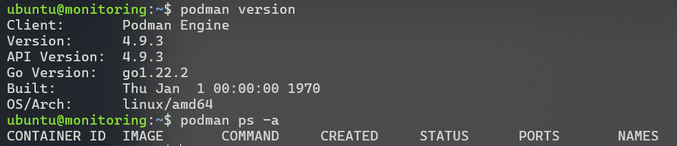

### Setup Prometheus

```bash
# Step 1 - Run the promethues conarianer

podman run -d --name prometheus -p 9090:9090 docker.io/prom/prometheus
```

```bash
# Step 2 - Open port 9090 on your cloud and from iptables

sudo iptables -L INPUT --line-numbers
sudo iptables -I INPUT 5 -p tcp --dport 9090 -j ACCEPT
```

Visit your-ip:9090 you will see the prometheus query page

Now that we know everything is runing fine stop the container

```bash
podman stop promethues
podman rm prometheus

```

```bash
# Step 3 - Create a promethues.ymal for scraping jenkins

mkdir -p ~/prometheus
cd ~/prometheus
nano prometheus.yml
```

prometheus.yml

```yaml
global:
  scrape_interval: 15s

scrape_configs:
  - job_name: "prometheus"
    static_configs:
      - targets: ["localhost:9090"]

  - job_name: "jenkins"
    metrics_path: /prometheus
    static_configs:
      - targets: ["<JENKINS_HOST>:8080"]
```

```bash
# Step 4 - Create a persistant volume and network for prometheus

podman volume create prometheus_data
podman network create monitoring
```

```bash
# Step 5 - Run prometheus with new comfig and volume

podman run -d --name prometheus \
  --network monitoring \
  -p 9090:9090 \
  -v /home/ubuntu/prometheus/prometheus.yml:/etc/prometheus/prometheus.yml:Z \
  -v prometheus_data:/prometheus:Z \
  docker.io/prom/prometheus
```

Now visit your-ip:9090/targets to check target's health

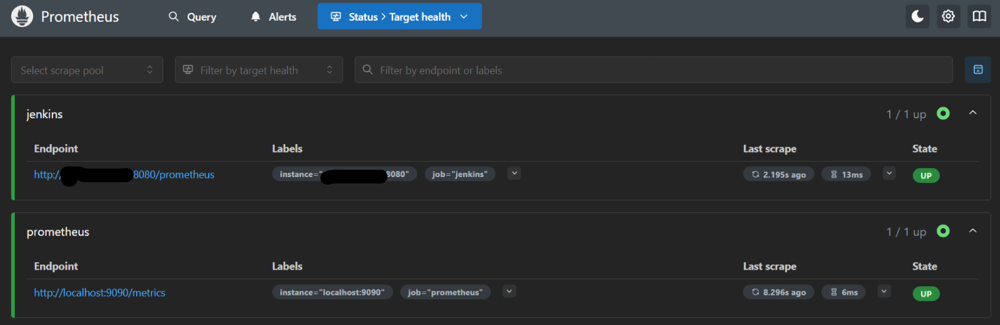

Make sure it is up and running

### Setup Grafana

```bash
# Step 1 - Open port 9090 on your cloud and from iptables

sudo iptables -L INPUT --line-numbers
sudo iptables -I INPUT 5 -p tcp --dport 3000 -j ACCEPT
```

```bash
# Step 2 - Add Grafana datasource

mkdir -p ~/grafana/provisioning/datasources
nano ~/grafana/provisioning/datasources/datasource.yml
```

datasource.yml

```yml
apiVersion: 1

datasources:
  - name: Prometheus
    type: prometheus
    access: proxy
    url: http://prometheus:9090
    isDefault: true
```

```bash
# Step 3 - Run Grafana container with its config and volume

podman volume create grafana_data

podman run -d --name grafana \
  --network monitoring \
  -p 3000:3000 \
  -v grafana_data:/var/lib/grafana:Z \
  -v "/home/ubuntu/grafana/provisioning:/etc/grafana/provisioning:Z" \
  docker.io/grafana/grafana
```


Now visit your-ip:3000 , you will see login page for grafana

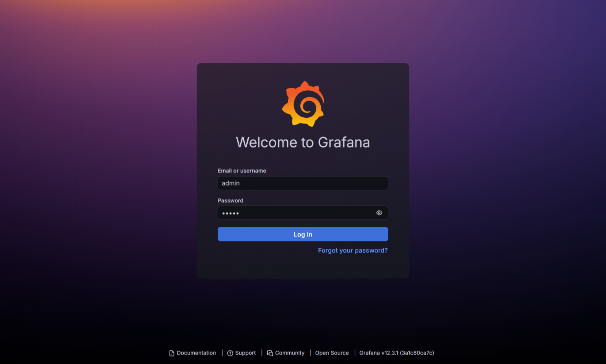

use deafult username and password admin & admin, Grafan will ask you to change the password, don't skip it.

You will land on home page

Navigate to **Connection > Data Sources > prometheus > Dashboards > Prometheus 2.0 Stats > Import**

It will tske you to the dashboard

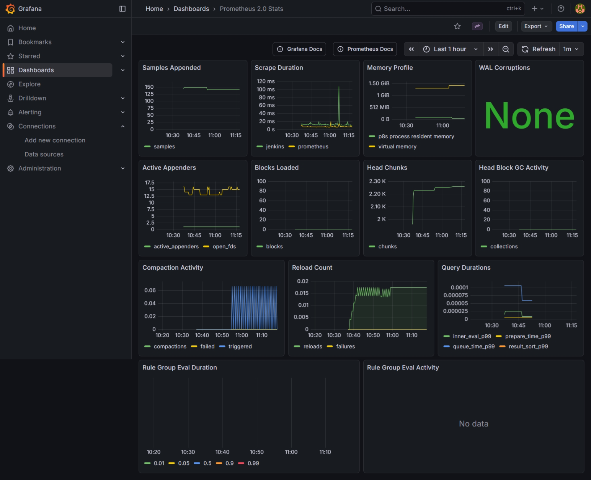

Now lets add Dashboard for jenkins

**Dashboard > New > Import > Use id 9964 > select data source prometheus > Import**

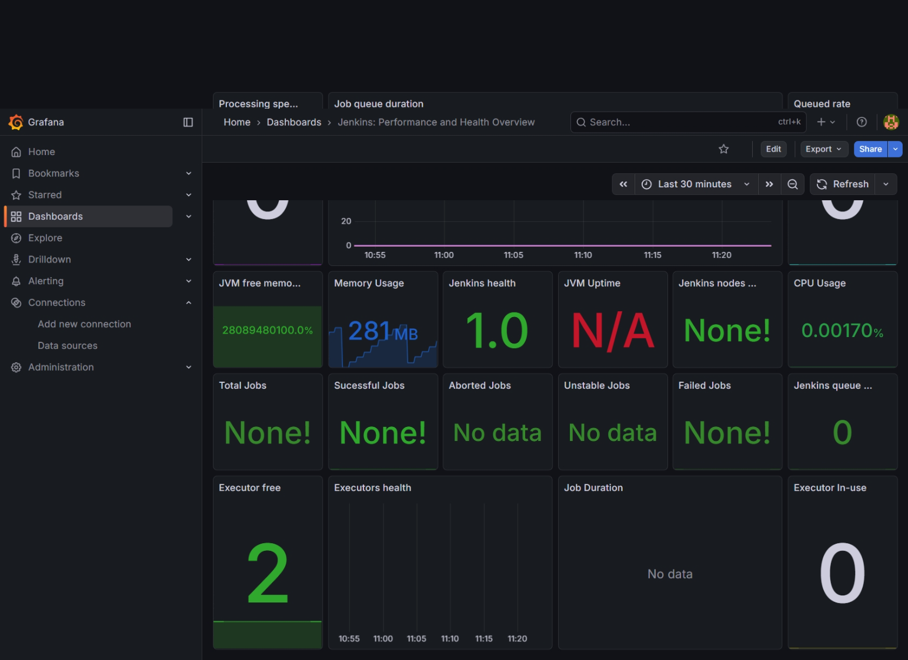